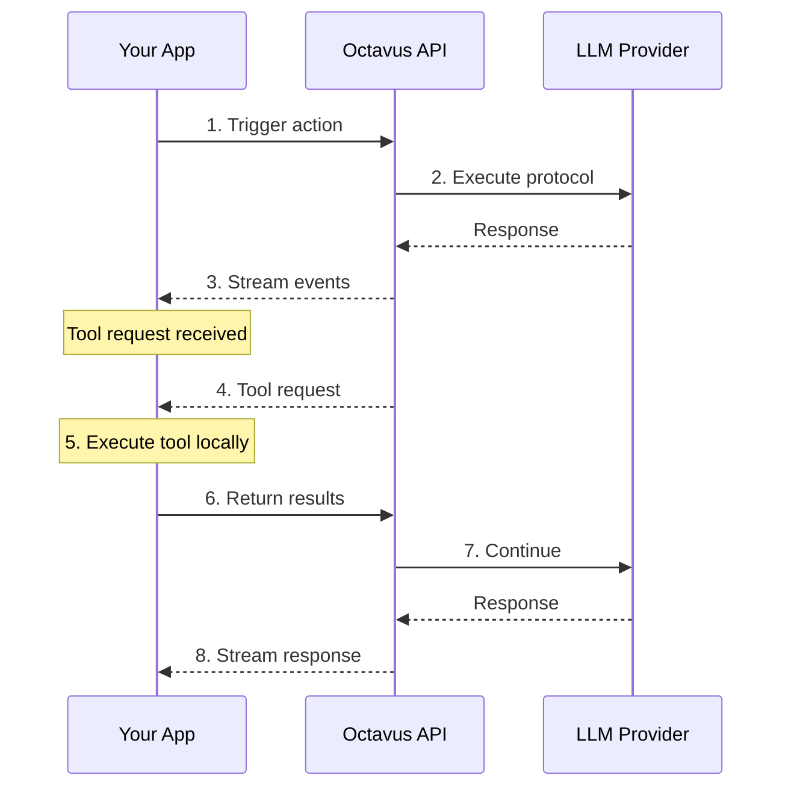

# Introduction to Octavus

Octavus is an agent orchestration platform that lets developers define, manage, and deploy AI agents through a unified service. It handles the orchestration layer so teams can focus on their agent logic and business requirements.

## What is Octavus?

Building and managing AI agents is complex. Developers face challenges with:

- **Fragmented tooling** — No unified way to define, manage, and deploy agents
- **Prompt management** — Prompts are scattered across codebases, hard to version and iterate
- **Integration complexity** — Connecting agents to tools, resources, and other agents requires significant custom work
- **Observability** — Difficult to debug, monitor, and understand agent behavior in production
- **Infrastructure overhead** — Teams rebuild the same agent infrastructure repeatedly

Octavus solves these problems by providing:

- A **protocol-based approach** to defining agent behavior
- **Agent Preview** for testing agents directly in the platform
- **Server and client SDKs** for easy integration
- **Built-in streaming** support for real-time responses
- **Tool execution** that runs on your servers with your data
- **Session management** for stateful conversations

## Core Concepts

### Agents

An **Agent** is the main entity in Octavus — a self-contained unit that defines how an AI agent behaves. Agents are defined using YAML protocols that specify:

- Input variables the agent accepts
- Triggers that invoke the agent (user messages, button clicks, API calls)
- Tools the agent can use
- Handlers that define execution flow

### Sessions

A **Session** represents a conversation with an agent. Sessions:

- Store conversation history
- Track resources and variables
- Enable stateful interactions across multiple messages

### Triggers

**Triggers** define how an agent is invoked:

- **User Message** — Respond to a text message in a chat interface
- **User Action** — Respond to UI actions (button clicks, form submissions)
- **API Call** — Direct invocation via SDK

### Tools

**Tools** extend what agents can do:

- **External Tools** — Consumer-defined tools that call back to your systems
- **Internal Tools** — Built-in capabilities (web search, code execution)

Tools execute on your server, not on Octavus, giving you full control over data and authentication.

## Architecture Overview

## Next Steps

- [Quick Start](/docs/getting-started/quickstart) — Get your first agent running in minutes
- [Server SDK](/docs/server-sdk/overview) — Learn about backend integration
- [Client SDK](/docs/client-sdk/overview) — Build chat interfaces with React (or other frameworks)
- [Protocol Reference](/docs/protocol/overview) — Deep dive into agent protocols
