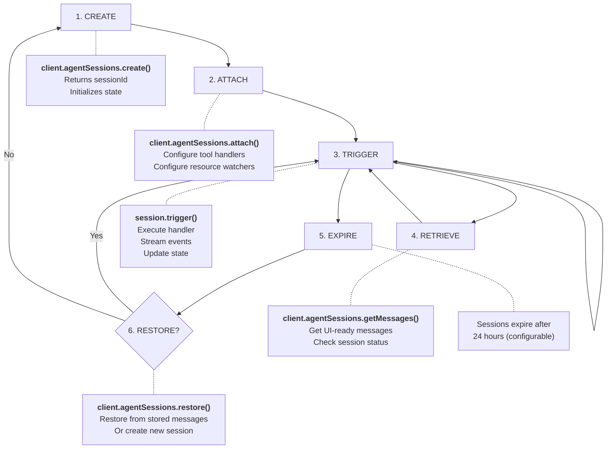

# Sessions

Sessions represent conversations with an agent. They store conversation history, track resources and variables, and enable stateful interactions.

## Creating Sessions

Create a session by specifying the agent ID and initial input variables:

```typescript
import { OctavusClient } from '@octavus/server-sdk';

const client = new OctavusClient({
  baseUrl: process.env.OCTAVUS_API_URL!,
  apiKey: process.env.OCTAVUS_API_KEY!,
});

// Create a session with the support-chat agent
const sessionId = await client.agentSessions.create('support-chat', {
  COMPANY_NAME: 'Acme Corp',
  PRODUCT_NAME: 'Widget Pro',
  USER_ID: 'user-123', // Optional inputs
});

console.log('Session created:', sessionId);
```

## Getting Session Messages

To restore a conversation on page load, use `getMessages()` to retrieve UI-ready messages:

```typescript
const session = await client.agentSessions.getMessages(sessionId);

console.log({
  sessionId: session.sessionId,
  agentId: session.agentId,
  messages: session.messages.length, // UIMessage[] ready for frontend
});
```

The returned messages can be passed directly to the client SDK's `initialMessages` option.

### UISessionState Interface

```typescript
interface UISessionState {
  sessionId: string;
  agentId: string;
  messages: UIMessage[]; // UI-ready conversation history
}
```

## Full Session State (Debug)

For debugging or internal use, you can retrieve the complete session state including all variables and internal message format:

```typescript
const state = await client.agentSessions.get(sessionId);

console.log({
  id: state.id,
  agentId: state.agentId,
  messages: state.messages.length, // ChatMessage[] (internal format)
  resources: state.resources,
  variables: state.variables,
  createdAt: state.createdAt,
  updatedAt: state.updatedAt,
});
```

> **Note**: Use `getMessages()` for client-facing code. The `get()` method returns internal message format that includes hidden content not intended for end users.

## Attaching to Sessions

To trigger actions on a session, you need to attach to it first:

```typescript
const session = client.agentSessions.attach(sessionId, {
  tools: {
    // Tool handlers (see Tools documentation)
  },
  resources: [
    // Resource watchers (optional)
  ],
});
```

## Triggering Actions

Once attached, trigger actions on the session:

```typescript
import { toSSEStream } from '@octavus/server-sdk';

// trigger() returns an async generator of events
const events = session.trigger('user-message', {
  USER_MESSAGE: 'How do I reset my password?',
});

// Convert to SSE stream for HTTP responses
return new Response(toSSEStream(events), {
  headers: { 'Content-Type': 'text/event-stream' },
});
```

### Stop Support

Pass an abort signal to allow clients to stop generation:

```typescript
// In your API route handler
const events = session.trigger(triggerName, input, {
  signal: request.signal, // Forward the client's abort signal
});
```

When the client aborts the request, the signal propagates through to the LLM provider, stopping generation immediately. Any partial content is preserved.

## Session Lifecycle



## Session Expiration

Sessions expire after a period of inactivity (default: 24 hours). When you call `getMessages()` or `get()`, the response includes a `status` field:

```typescript
const result = await client.agentSessions.getMessages(sessionId);

if (result.status === 'expired') {
  // Session has expired - restore or create new
  console.log('Session expired:', result.sessionId);
} else {
  // Session is active
  console.log('Messages:', result.messages.length);
}
```

### Response Types

| Status    | Type                  | Description                                                   |
| --------- | --------------------- | ------------------------------------------------------------- |
| `active`  | `UISessionState`      | Session is active, includes `messages` array                  |
| `expired` | `ExpiredSessionState` | Session expired, includes `sessionId`, `agentId`, `createdAt` |

## Persisting Chat History

To enable session restoration, store the chat messages in your own database after each interaction:

```typescript
// After each trigger completes, save messages
const result = await client.agentSessions.getMessages(sessionId);

if (result.status === 'active') {
  // Store in your database
  await db.chats.update({
    where: { id: chatId },
    data: {
      sessionId: result.sessionId,
      messages: result.messages, // Store UIMessage[] as JSON
    },
  });
}
```

> **Best Practice**: Store the full `UIMessage[]` array. This preserves all message parts (text, tool calls, files, etc.) needed for accurate restoration.

## Restoring Sessions

When a user returns to your app:

```typescript
// 1. Load stored data from your database
const chat = await db.chats.findUnique({ where: { id: chatId } });

// 2. Check if session is still active
const result = await client.agentSessions.getMessages(chat.sessionId);

if (result.status === 'active') {
  // Session is active - use it directly
  return {
    sessionId: result.sessionId,
    messages: result.messages,
  };
}

// 3. Session expired - restore from stored messages
if (chat.messages && chat.messages.length > 0) {
  const restored = await client.agentSessions.restore(
    chat.sessionId,
    chat.messages,
    { COMPANY_NAME: 'Acme Corp' }, // Optional: same input as create()
  );

  if (restored.restored) {
    // Session restored successfully
    return {
      sessionId: restored.sessionId,
      messages: chat.messages,
    };
  }
}

// 4. Cannot restore - create new session
const newSessionId = await client.agentSessions.create('support-chat', {
  COMPANY_NAME: 'Acme Corp',
});

return {
  sessionId: newSessionId,
  messages: [],
};
```

### Restore Response

```typescript
interface RestoreSessionResult {
  sessionId: string;
  restored: boolean; // true if restored, false if session was already active
}
```

## Complete Example

Here's a complete session management flow:

```typescript
import { OctavusClient } from '@octavus/server-sdk';

const client = new OctavusClient({
  baseUrl: process.env.OCTAVUS_API_URL!,
  apiKey: process.env.OCTAVUS_API_KEY!,
});

async function getOrCreateSession(chatId: string, agentId: string, input: Record<string, unknown>) {
  // Load existing chat data
  const chat = await db.chats.findUnique({ where: { id: chatId } });

  if (chat?.sessionId) {
    // Check session status
    const result = await client.agentSessions.getMessages(chat.sessionId);

    if (result.status === 'active') {
      return { sessionId: result.sessionId, messages: result.messages };
    }

    // Try to restore expired session
    if (chat.messages?.length > 0) {
      const restored = await client.agentSessions.restore(chat.sessionId, chat.messages, input);
      if (restored.restored) {
        return { sessionId: restored.sessionId, messages: chat.messages };
      }
    }
  }

  // Create new session
  const sessionId = await client.agentSessions.create(agentId, input);

  // Save to database
  await db.chats.upsert({
    where: { id: chatId },
    create: { id: chatId, sessionId, messages: [] },
    update: { sessionId, messages: [] },
  });

  return { sessionId, messages: [] };
}
```

## Error Handling

```typescript
import { ApiError } from '@octavus/server-sdk';

try {
  const session = await client.agentSessions.getMessages(sessionId);
} catch (error) {
  if (error instanceof ApiError) {
    if (error.status === 404) {
      // Session not found or expired
      console.log('Session expired, create a new one');
    } else {
      console.error('API Error:', error.message);
    }
  }
  throw error;
}
```
