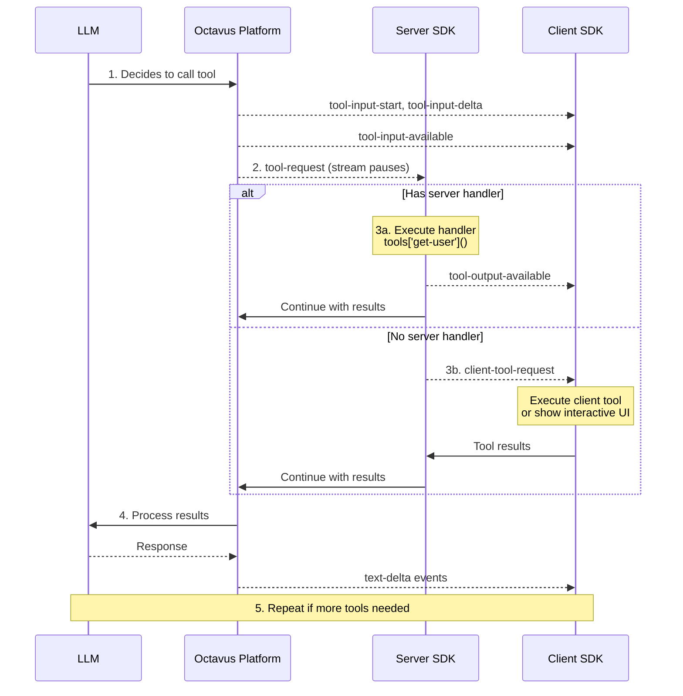

# Tools

Tools extend what agents can do. In Octavus, tools can execute either on your server or on the client side.

## Server Tools vs Client Tools

| Location   | Use Case                                          | Registration                            |
| ---------- | ------------------------------------------------- | --------------------------------------- |
| **Server** | Database queries, API calls, sensitive operations | Register handler in `attach()`          |
| **Client** | Browser APIs, interactive UIs, confirmations      | No server handler (forwarded to client) |

When the Server SDK encounters a tool call:

1. **Handler exists** → Execute on server, continue automatically
2. **No handler** → Forward to client via `client-tool-request` event

For client-side tool handling, see [Client Tools](/docs/client-sdk/client-tools).

## Why Server Tools

Server-side tools give you full control:

- ✅ **Full data access** — Query your database directly
- ✅ **Your authentication** — Use your existing auth context
- ✅ **No data exposure** — Sensitive data never leaves your infrastructure
- ✅ **Custom logic** — Any complexity you need

## Defining Tool Handlers

Tool handlers are async functions that receive arguments and return results:

```typescript
import type { ToolHandlers } from '@octavus/server-sdk';

const tools: ToolHandlers = {
  'get-user-account': async (args) => {
    const userId = args.userId as string;

    // Query your database
    const user = await db.users.findById(userId);

    return {
      name: user.name,
      email: user.email,
      plan: user.subscription.plan,
      createdAt: user.createdAt.toISOString(),
    };
  },

  'create-support-ticket': async (args) => {
    const summary = args.summary as string;
    const priority = args.priority as string;

    // Create ticket in your system
    const ticket = await ticketService.create({
      summary,
      priority,
      source: 'ai-chat',
    });

    return {
      ticketId: ticket.id,
      estimatedResponse: getEstimatedResponse(priority),
    };
  },
};
```

## Using Tools in Sessions

Pass tool handlers when attaching to a session:

```typescript
const session = client.agentSessions.attach(sessionId, {
  tools: {
    'get-user-account': async (args) => {
      // Implementation
    },
    'create-support-ticket': async (args) => {
      // Implementation
    },
  },
});
```

## Tool Handler Signature

```typescript
type ToolHandler = (args: Record<string, unknown>) => Promise<unknown>;
type ToolHandlers = Record<string, ToolHandler>;
```

### Arguments

Arguments are passed as a `Record<string, unknown>`. Type-check as needed:

```typescript
'search-products': async (args) => {
  const query = args.query as string;
  const category = args.category as string | undefined;
  const maxPrice = args.maxPrice as number | undefined;

  return await productSearch({ query, category, maxPrice });
}
```

### Return Values

Return any JSON-serializable value. The result is:

1. Sent back to the LLM as context
2. Stored in session state
3. Optionally stored in a variable for protocol use

```typescript
// Return object
return { id: '123', status: 'created' };

// Return array
return [{ id: '1' }, { id: '2' }];

// Return primitive
return 42;

// Return null for "no result"
return null;
```

## Error Handling

Throw errors for failures. They're captured and sent to the LLM:

```typescript
'get-user-account': async (args) => {
  const userId = args.userId as string;

  const user = await db.users.findById(userId);

  if (!user) {
    throw new Error(`User not found: ${userId}`);
  }

  return user;
}
```

The LLM receives the error message and can respond appropriately (e.g., "I couldn't find that account").

## Tool Execution Flow

When the LLM calls a tool:



## Accessing Request Context

For request-specific data (auth, headers), create handlers dynamically:

```typescript
import { toSSEStream } from '@octavus/server-sdk';

// In your API route
export async function POST(request: Request) {
  const body = await request.json();
  const { sessionId, ...payload } = body;

  const authToken = request.headers.get('Authorization');
  const user = await validateToken(authToken);

  const session = client.agentSessions.attach(sessionId, {
    tools: {
      'get-user-account': async (args) => {
        // Use request context
        return await db.users.findById(user.id);
      },
      'create-order': async (args) => {
        // Create with user context
        return await orderService.create({
          ...args,
          userId: user.id,
          createdBy: user.email,
        });
      },
      // Tools without handlers here are forwarded to the client
    },
  });

  const events = session.execute(payload, { signal: request.signal });
  return new Response(toSSEStream(events));
}
```

## Best Practices

### 1. Validate Arguments

```typescript
'create-ticket': async (args) => {
  const summary = args.summary;
  if (typeof summary !== 'string' || summary.length === 0) {
    throw new Error('Summary is required');
  }
  // ...
}
```

### 2. Handle Timeouts

```typescript
'external-api-call': async (args) => {
  const controller = new AbortController();
  const timeout = setTimeout(() => controller.abort(), 10000);

  try {
    const response = await fetch(url, { signal: controller.signal });
    return await response.json();
  } finally {
    clearTimeout(timeout);
  }
}
```

### 3. Log Tool Calls

```typescript
'search-products': async (args) => {
  console.log('Tool call: search-products', { args });

  const result = await productSearch(args);

  console.log('Tool result: search-products', {
    resultCount: result.length
  });

  return result;
}
```
