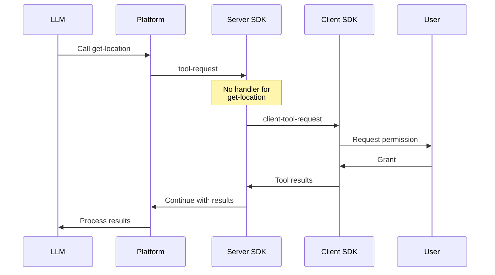

# Client Tools

By default, tools execute on your server where you have access to databases and APIs. However, some tools are better suited for client-side execution:

- **Browser-only operations** — Geolocation, clipboard, local storage
- **Interactive UIs** — Confirmation dialogs, form inputs, selections
- **Real-time feedback** — Progress indicators, approval workflows

## How Client Tools Work

When the agent calls a tool, the Server SDK checks for a registered handler:

1. **Handler exists** → Execute on server, continue automatically
2. **No handler** → Forward to client as `client-tool-request` event

The client SDK receives pending tool calls, executes them (automatically or via user interaction), and sends results back to continue the conversation.



## Setup

### Server Side

Define tools in your protocol but don't register handlers for client tools:

```typescript
// Only register server-side tools
const session = client.agentSessions.attach(sessionId, {
  tools: {
    // Server tools have handlers
    'get-user-account': async (args) => {
      return await db.users.findById(args.userId);
    },
    // Client tools have NO handler here
    // 'get-browser-location' - handled on client
    // 'request-feedback' - handled on client
  },
});
```

### Client Side

Register client tool handlers when creating the chat:

```typescript
const { messages, status, pendingClientTools } = useOctavusChat({
  transport,
  clientTools: {
    // Automatic client tool
    'get-browser-location': async () => {
      const pos = await new Promise((resolve, reject) => {
        navigator.geolocation.getCurrentPosition(resolve, reject);
      });
      return { lat: pos.coords.latitude, lng: pos.coords.longitude };
    },

    // Interactive client tool (requires user action)
    'request-feedback': 'interactive',
  },
});
```

## Automatic Client Tools

Automatic tools execute immediately when called. Use these for browser operations that don't require user input.

### Example: Geolocation

```typescript
const { messages, status } = useOctavusChat({
  transport,
  clientTools: {
    'get-browser-location': async (args, ctx) => {
      // ctx provides toolCallId, toolName, and abort signal
      const pos = await new Promise<GeolocationPosition>((resolve, reject) => {
        navigator.geolocation.getCurrentPosition(resolve, reject, {
          timeout: 10000,
        });
      });

      return {
        latitude: pos.coords.latitude,
        longitude: pos.coords.longitude,
        accuracy: pos.coords.accuracy,
      };
    },
  },
});
```

### Example: Clipboard

```typescript
clientTools: {
  'copy-to-clipboard': async (args) => {
    await navigator.clipboard.writeText(args.text as string);
    return { success: true };
  },

  'read-clipboard': async () => {
    const text = await navigator.clipboard.readText();
    return { text };
  },
}
```

### Context Object

Automatic handlers receive a context object:

```typescript
interface ClientToolContext {
  toolCallId: string; // Unique ID for this call
  toolName: string; // Name of the tool
  signal: AbortSignal; // Aborted if user stops generation
}
```

Use the signal to cancel long-running operations:

```typescript
'fetch-external-data': async (args, ctx) => {
  const response = await fetch(args.url, {
    signal: ctx.signal,  // Cancels if user stops
  });
  return await response.json();
}
```

## Interactive Client Tools

Interactive tools require user input before completing. Use these for confirmations, forms, or any UI that needs user action.

Mark a tool as interactive by setting its handler to `'interactive'`:

```typescript
const { messages, status, pendingClientTools } = useOctavusChat({
  transport,
  clientTools: {
    'request-feedback': 'interactive',
    'confirm-action': 'interactive',
    'select-option': 'interactive',
  },
});
```

### Accessing Pending Tools

Interactive tools appear in `pendingClientTools`, keyed by tool name:

```typescript
// pendingClientTools structure:
{
  'request-feedback': [
    {
      toolCallId: 'call_abc123',
      toolName: 'request-feedback',
      args: { question: 'How would you rate this response?' },
      submit: (result) => void,  // Call with user's input
      cancel: (reason?) => void, // Call if user dismisses
    }
  ],
  'confirm-action': [
    // Multiple calls to same tool are possible
  ]
}
```

### Rendering Interactive UIs

```tsx
function Chat() {
  const { messages, status, pendingClientTools, send } = useOctavusChat({
    transport,
    clientTools: {
      'request-feedback': 'interactive',
    },
  });

  const feedbackTools = pendingClientTools['request-feedback'] ?? [];

  return (
    <div>
      {/* Chat messages */}
      <MessageList messages={messages} />

      {/* Interactive tool UIs */}
      {feedbackTools.map((tool) => (
        <FeedbackModal
          key={tool.toolCallId}
          question={tool.args.question as string}
          onSubmit={(rating, comment) => {
            tool.submit({ rating, comment });
          }}
          onCancel={() => {
            tool.cancel('User dismissed');
          }}
        />
      ))}

      {/* Input disabled while awaiting user action */}
      <ChatInput disabled={status === 'awaiting-input'} />
    </div>
  );
}
```

### Example: Confirmation Dialog

```tsx
function ConfirmationDialog({ tool }: { tool: InteractiveTool }) {
  const { action, description } = tool.args as {
    action: string;
    description: string;
  };

  return (
    <div className="fixed inset-0 bg-black/50 flex items-center justify-center">
      <div className="bg-white p-6 rounded-lg max-w-md">
        <h3 className="text-lg font-semibold">Confirm {action}</h3>
        <p className="mt-2 text-gray-600">{description}</p>
        <div className="mt-4 flex gap-3 justify-end">
          <button onClick={() => tool.cancel()} className="px-4 py-2 border rounded">
            Cancel
          </button>
          <button
            onClick={() => tool.submit({ confirmed: true })}
            className="px-4 py-2 bg-blue-500 text-white rounded"
          >
            Confirm
          </button>
        </div>
      </div>
    </div>
  );
}
```

### Example: Form Input

```tsx
function FormInputTool({ tool }: { tool: InteractiveTool }) {
  const [values, setValues] = useState<Record<string, string>>({});
  const fields = tool.args.fields as { name: string; label: string; type: string }[];

  const handleSubmit = (e: React.FormEvent) => {
    e.preventDefault();
    tool.submit(values);
  };

  return (
    <form onSubmit={handleSubmit} className="p-4 border rounded-lg">
      {fields.map((field) => (
        <div key={field.name} className="mb-4">
          <label className="block text-sm font-medium">{field.label}</label>
          <input
            type={field.type}
            value={values[field.name] ?? ''}
            onChange={(e) => setValues({ ...values, [field.name]: e.target.value })}
            className="mt-1 w-full px-3 py-2 border rounded"
          />
        </div>
      ))}
      <div className="flex gap-2 justify-end">
        <button type="button" onClick={() => tool.cancel()} className="px-4 py-2 border rounded">
          Cancel
        </button>
        <button type="submit" className="px-4 py-2 bg-blue-500 text-white rounded">
          Submit
        </button>
      </div>
    </form>
  );
}
```

## Status: awaiting-input

When interactive tools are pending, the chat status changes to `'awaiting-input'`:

```typescript
type ChatStatus = 'idle' | 'streaming' | 'error' | 'awaiting-input';
```

Use this to:

- Disable the send button
- Show "Waiting for input" indicators
- Prevent new messages until tools complete

```tsx
function ChatInput({ status }: { status: ChatStatus }) {
  const isDisabled = status === 'streaming' || status === 'awaiting-input';

  return (
    <div>
      {status === 'awaiting-input' && (
        <div className="text-amber-600 text-sm mb-2">
          Please respond to the prompt above to continue
        </div>
      )}
      <input disabled={isDisabled} placeholder="Type a message..." />
    </div>
  );
}
```

## Mixed Server and Client Tools

Tools can be split between server and client based on where they should execute:

```typescript
// Server (API route)
const session = client.agentSessions.attach(sessionId, {
  tools: {
    // Server tools - data access, mutations
    'get-user-account': async (args) => db.users.findById(args.userId),
    'create-order': async (args) => orderService.create(args),
  },
});

// Client
const chat = useOctavusChat({
  transport,
  clientTools: {
    // Automatic - browser capabilities
    'get-browser-location': async () => getGeolocation(),

    // Interactive - user confirmation
    'confirm-order': 'interactive',
  },
});
```

When the LLM calls multiple tools in one turn:

1. Server tools execute first on the server
2. Server results are included in the `client-tool-request` event
3. Client tools execute (automatic immediately, interactive waits)
4. All results are sent together to continue

## HTTP Transport

The HTTP transport handles client tool continuation automatically via a unified request pattern:

```typescript
const transport = createHttpTransport({
  // Single request handler for both triggers and continuations
  request: (payload, options) =>
    fetch('/api/trigger', {
      method: 'POST',
      headers: { 'Content-Type': 'application/json' },
      body: JSON.stringify({ sessionId, ...payload }),
      signal: options?.signal,
    }),
});
```

Your API route handles both request types:

```typescript
// app/api/trigger/route.ts
export async function POST(request: Request) {
  const body = await request.json();
  const { sessionId, ...payload } = body;

  const session = client.agentSessions.attach(sessionId, {
    tools: {
      // Server tools only
    },
  });

  // execute() handles both triggers and continuations
  const events = session.execute(payload, { signal: request.signal });

  return new Response(toSSEStream(events), {
    headers: { 'Content-Type': 'text/event-stream' },
  });
}
```

## Socket Transport

The socket transport sends a `continue` message with tool results:

### Client → Server Messages

```typescript
// Trigger (start new conversation turn)
{ type: 'trigger', triggerName: string, input?: object }

// Continue (after client tool handling)
{ type: 'continue', executionId: string, toolResults: ToolResult[] }

// Stop (cancel current operation)
{ type: 'stop' }
```

### Server Handler

```typescript
async function handleMessage(rawData: string, conn: Connection, session: AgentSession) {
  const msg = JSON.parse(rawData);

  if (msg.type === 'stop') {
    abortController?.abort();
    return;
  }

  // execute() handles both trigger and continue
  const events = session.execute(msg, { signal: abortController?.signal });

  for await (const event of events) {
    conn.write(JSON.stringify(event));
  }
}
```

## Error Handling

### Automatic Tool Errors

Errors in automatic handlers are caught and sent back to the LLM:

```typescript
clientTools: {
  'get-browser-location': async () => {
    // If geolocation fails, the error is captured
    const pos = await new Promise((resolve, reject) => {
      navigator.geolocation.getCurrentPosition(resolve, reject);
    });
    return { lat: pos.coords.latitude, lng: pos.coords.longitude };
  },
}
```

The LLM receives: `"Tool error: User denied geolocation"`

### Interactive Tool Cancellation

When users cancel interactive tools, provide a reason:

```typescript
tool.cancel('User chose not to confirm');
```

The LLM receives the cancellation reason and can respond appropriately.

### Missing Handlers

If a client tool has no handler registered, an error is sent automatically:

```
"No client handler for tool: some-tool-name"
```

## Best Practices

### 1. Keep Server Tools on Server

Don't move database or API operations to client tools:

```typescript
// Good - data access on server
// Server:
tools: { 'get-user': async (args) => db.users.find(args.id) }

// Bad - exposing data access to client
// Client:
clientTools: { 'get-user': async (args) => fetch('/api/users/' + args.id) }
```

### 2. Use Interactive for Confirmations

Any destructive or important action should confirm with the user:

```typescript
clientTools: {
  'confirm-delete': 'interactive',
  'confirm-purchase': 'interactive',
  'confirm-send-email': 'interactive',
}
```

### 3. Handle Cancellation Gracefully

Always provide cancel buttons for interactive tools:

```tsx
<Dialog>
  <button onClick={() => tool.submit(result)}>Confirm</button>
  <button onClick={() => tool.cancel()}>Cancel</button>
</Dialog>
```

### 4. Validate Results

Validate user input before submitting:

```typescript
const handleSubmit = () => {
  if (!rating || rating < 1 || rating > 5) {
    setError('Please select a rating');
    return;
  }
  tool.submit({ rating });
};
```

## Type Reference

```typescript
// Handler types
type ClientToolHandler =
  | ((args: Record<string, unknown>, ctx: ClientToolContext) => Promise<unknown>)
  | 'interactive';

interface ClientToolContext {
  toolCallId: string;
  toolName: string;
  signal: AbortSignal;
}

// Interactive tool (with bound methods)
interface InteractiveTool {
  toolCallId: string;
  toolName: string;
  args: Record<string, unknown>;
  submit: (result: unknown) => void;
  cancel: (reason?: string) => void;
}

// Chat status
type ChatStatus = 'idle' | 'streaming' | 'error' | 'awaiting-input';
```
