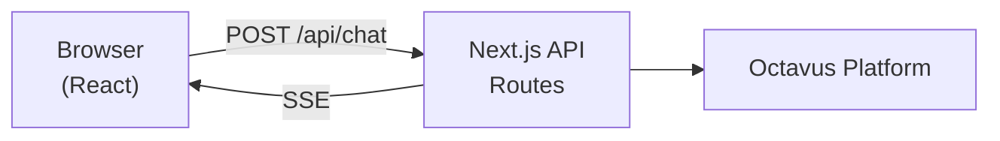

# Next.js Chat Example

This example builds a support chat interface using Next.js App Router with HTTP/SSE transport. This is the recommended pattern for most web applications.

## What You're Building

A chat interface that:

- Creates sessions server-side
- Streams AI responses in real-time
- Handles tool calls on your server
- Shows typing status during streaming

## Architecture



## Prerequisites

- Next.js 14+ with App Router
- Octavus account with API key
- An agent configured in Octavus

## Step 1: Install Dependencies

```bash
npm install @octavus/server-sdk @octavus/react
```

## Step 2: Configure Environment

```bash
# .env.local
OCTAVUS_API_URL=https://octavus.ai
OCTAVUS_API_KEY=your-api-key
```

## Step 3: Create the Octavus Client

```typescript
// lib/octavus.ts
import { OctavusClient } from '@octavus/server-sdk';

export const octavus = new OctavusClient({
  baseUrl: process.env.OCTAVUS_API_URL!,
  apiKey: process.env.OCTAVUS_API_KEY!,
});
```

## Step 4: Create Upload URLs Endpoint (Optional)

If your agent supports file uploads (images, documents), create an endpoint to get presigned URLs:

```typescript
// app/api/upload-urls/route.ts
import { NextResponse } from 'next/server';
import { octavus } from '@/lib/octavus';

export async function POST(request: Request) {
  const { sessionId, files } = await request.json();

  // Get presigned URLs from Octavus
  const result = await octavus.files.getUploadUrls(sessionId, files);

  return NextResponse.json(result);
}
```

## Step 5: Create Session Endpoint

Sessions hold conversation state. Create one when the user opens the chat:

```typescript
// app/api/sessions/route.ts
import { NextResponse } from 'next/server';
import { octavus } from '@/lib/octavus';

export async function POST(request: Request) {
  const { agentId, input } = await request.json();

  // Create a new session with initial input variables
  const sessionId = await octavus.agentSessions.create(agentId, input);

  return NextResponse.json({ sessionId });
}
```

**Protocol Note:** The `input` object contains variables defined in your agent's protocol. For example, if your agent has `COMPANY_NAME` as an input variable:

```typescript
const sessionId = await octavus.agentSessions.create(agentId, {
  COMPANY_NAME: 'Acme Corp',
  USER_ID: user.id,
});
```

## Step 6: Create Trigger Endpoint

Triggers execute agent actions. The `user-message` trigger is the most common:

```typescript
// app/api/trigger/route.ts
import { toSSEStream } from '@octavus/server-sdk';
import { octavus } from '@/lib/octavus';

export async function POST(request: Request) {
  const body = await request.json();
  const { sessionId, ...payload } = body;

  // Attach to the session with tool handlers
  const session = octavus.agentSessions.attach(sessionId, {
    tools: {
      // Server-side tool handlers run on YOUR server, not Octavus
      'get-user-account': async (args) => {
        const userId = args.userId as string;
        // Fetch from your database
        const user = await db.users.findUnique({ where: { id: userId } });
        return {
          name: user.name,
          email: user.email,
          plan: user.plan,
        };
      },

      'create-support-ticket': async (args) => {
        const ticket = await db.tickets.create({
          data: {
            summary: args.summary as string,
            priority: args.priority as string,
          },
        });
        return {
          ticketId: ticket.id,
          estimatedResponse: '24 hours',
        };
      },

      // Tools without handlers here are forwarded to the client
      // See Client Tools docs for handling on frontend
    },
  });

  // execute() handles both triggers and client tool continuations
  const events = session.execute(payload, { signal: request.signal });

  return new Response(toSSEStream(events), {
    headers: {
      'Content-Type': 'text/event-stream',
      'Cache-Control': 'no-cache',
      Connection: 'keep-alive',
    },
  });
}
```

**Protocol Note:** Tool names and arguments are defined in your agent's protocol YAML. The tool handlers here must match those definitions. Tools without server handlers are forwarded to the client.

## Step 7: Build the Chat Component

```tsx
// components/Chat.tsx
'use client';

import { useState, useMemo } from 'react';
import { useOctavusChat, createHttpTransport } from '@octavus/react';

interface ChatProps {
  sessionId: string;
}

export function Chat({ sessionId }: ChatProps) {
  const [inputValue, setInputValue] = useState('');

  // Create transport - memoized on sessionId
  const transport = useMemo(
    () =>
      createHttpTransport({
        request: (payload, options) =>
          fetch('/api/trigger', {
            method: 'POST',
            headers: { 'Content-Type': 'application/json' },
            body: JSON.stringify({ sessionId, ...payload }),
            signal: options?.signal,
          }),
      }),
    [sessionId],
  );

  const { messages, status, send } = useOctavusChat({ transport });

  const handleSubmit = async (e: React.FormEvent) => {
    e.preventDefault();
    if (!inputValue.trim() || status === 'streaming') return;

    const message = inputValue.trim();
    setInputValue('');

    // Send triggers the 'user-message' action
    // The third argument adds the user message to the UI
    await send('user-message', { USER_MESSAGE: message }, { userMessage: { content: message } });
  };

  return (
    <div className="flex flex-col h-screen">
      {/* Messages */}
      <div className="flex-1 overflow-y-auto p-4 space-y-4">
        {messages.map((msg) => (
          <div key={msg.id} className={msg.role === 'user' ? 'text-right' : 'text-left'}>
            <div
              className={`inline-block p-3 rounded-lg ${
                msg.role === 'user' ? 'bg-blue-500 text-white' : 'bg-gray-100'
              }`}
            >
              {msg.parts.map((part, i) => {
                if (part.type === 'text') {
                  return <p key={i}>{part.text}</p>;
                }
                if (part.type === 'tool-call') {
                  return (
                    <div key={i} className="text-sm opacity-70">
                      Using {part.toolName}...
                    </div>
                  );
                }
                return null;
              })}
            </div>
          </div>
        ))}
      </div>

      {/* Input */}
      <form onSubmit={handleSubmit} className="p-4 border-t">
        <div className="flex gap-2">
          <input
            type="text"
            value={inputValue}
            onChange={(e) => setInputValue(e.target.value)}
            placeholder="Type a message..."
            className="flex-1 px-4 py-2 border rounded-lg"
            disabled={status === 'streaming'}
          />
          <button
            type="submit"
            disabled={status === 'streaming'}
            className="px-4 py-2 bg-blue-500 text-white rounded-lg"
          >
            {status === 'streaming' ? 'Sending...' : 'Send'}
          </button>
        </div>
      </form>
    </div>
  );
}
```

## Step 8: Create the Page

```tsx
// app/chat/page.tsx
'use client';

import { useEffect, useState } from 'react';
import { Chat } from '@/components/Chat';

const AGENT_ID = 'your-agent-id'; // From Octavus dashboard

export default function ChatPage() {
  const [sessionId, setSessionId] = useState<string | null>(null);

  useEffect(() => {
    // Create session on mount
    fetch('/api/sessions', {
      method: 'POST',
      headers: { 'Content-Type': 'application/json' },
      body: JSON.stringify({
        agentId: AGENT_ID,
        input: {
          COMPANY_NAME: 'Acme Corp',
        },
      }),
    })
      .then((res) => res.json())
      .then((data) => setSessionId(data.sessionId));
  }, []);

  if (!sessionId) {
    return <div className="p-8">Loading...</div>;
  }

  return <Chat sessionId={sessionId} />;
}
```

## Protocol Integration

Your agent's protocol defines the triggers and tools. Here's how the code maps to protocol:

### Triggers

```yaml
# In your agent's protocol.yaml
triggers:
  user-message:
    description: User sends a chat message
    input:
      USER_MESSAGE:
        type: string
        description: The user's message
```

The `send()` call maps directly:

```typescript
await send(
  'user-message', // trigger name
  { USER_MESSAGE: message }, // trigger inputs
  { userMessage: { content: message } },
);
```

### Tools

```yaml
# In your agent's protocol.yaml
tools:
  get-user-account:
    description: Fetch user account details
    parameters:
      userId:
        type: string
        description: The user ID to look up
```

Tool handlers receive the parameters as `args`:

```typescript
'get-user-account': async (args) => {
  const userId = args.userId as string;
  // ...
}
```

## Next Steps

- [Protocol Overview](/docs/protocol/overview) — Define agent behavior
- [Messages](/docs/client-sdk/messages) — Rich message rendering
- [Streaming](/docs/client-sdk/streaming) — Advanced streaming UI
