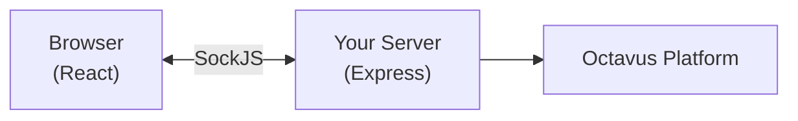

# Socket Chat Example

This example builds a chat interface using SockJS for bidirectional communication. Use this pattern for Meteor, Phoenix, or when you need custom real-time events.

## What You're Building

A chat interface that:

- Uses SockJS for real-time streaming
- Manages sessions server-side (client doesn't need sessionId)
- Supports custom events alongside chat
- Works with frameworks that use WebSocket-like transports

## Architecture



**Key difference from HTTP:** The server maintains a persistent socket connection and manages sessions internally. The client never needs to know about `sessionId`.

## Prerequisites

- Express (or similar Node.js server)
- React frontend
- `sockjs` (server) and `sockjs-client` (client)
- Octavus account with API key

## Step 1: Install Dependencies

**Server:**

```bash
npm install @octavus/server-sdk sockjs express
npm install -D @types/sockjs @types/express
```

**Client:**

```bash
npm install @octavus/react sockjs-client
npm install -D @types/sockjs-client
```

## Step 2: Configure Environment

```bash
# .env
OCTAVUS_API_URL=https://octavus.ai
OCTAVUS_API_KEY=your-api-key
OCTAVUS_AGENT_ID=your-agent-id
```

## Step 3: Create the Octavus Client (Server)

```typescript
// server/octavus/client.ts
import { OctavusClient } from '@octavus/server-sdk';

export const octavus = new OctavusClient({
  baseUrl: process.env.OCTAVUS_API_URL!,
  apiKey: process.env.OCTAVUS_API_KEY!,
});

export const AGENT_ID = process.env.OCTAVUS_AGENT_ID!;
```

## Step 4: Create the Socket Handler (Server)

This is the core of socket integration. Each connection gets its own session:

```typescript
// server/octavus/socket-handler.ts
import type { Connection } from 'sockjs';
import { OctavusClient, type AgentSession, type SocketMessage } from '@octavus/server-sdk';

const octavus = new OctavusClient({
  baseUrl: process.env.OCTAVUS_API_URL!,
  apiKey: process.env.OCTAVUS_API_KEY!,
});

const AGENT_ID = process.env.OCTAVUS_AGENT_ID!;

export function createSocketHandler() {
  return (conn: Connection) => {
    let session: AgentSession | null = null;

    const send = (data: unknown) => conn.write(JSON.stringify(data));

    conn.on('data', (rawData: string) => {
      void handleMessage(rawData);
    });

    async function handleMessage(rawData: string) {
      const msg = JSON.parse(rawData);

      // Handle trigger, continue, and stop messages
      if (msg.type === 'trigger' || msg.type === 'continue' || msg.type === 'stop') {
        // Create session lazily on first trigger
        if (!session && msg.type === 'trigger') {
          const sessionId = await octavus.agentSessions.create(AGENT_ID, {
            COMPANY_NAME: 'Acme Corp',
          });

          session = octavus.agentSessions.attach(sessionId, {
            tools: {
              'get-user-account': async () => {
                return { name: 'Demo User', plan: 'pro' };
              },
              'create-support-ticket': async () => {
                return { ticketId: 'TKT-123', estimatedResponse: '24h' };
              },
            },
          });
        }

        if (!session) return;

        // handleSocketMessage manages abort controller internally
        await session.handleSocketMessage(msg as SocketMessage, {
          onEvent: send,
        });
      }
    }

    conn.on('close', () => {});
  };
}
```

## Step 5: Set Up the Express Server

```typescript
// server/index.ts
import express from 'express';
import http from 'http';
import sockjs from 'sockjs';
import { createSocketHandler } from './octavus/socket-handler';

const app = express();
const server = http.createServer(app);

// Create SockJS server
const sockServer = sockjs.createServer({
  prefix: '/octavus',
  log: () => {}, // Silence logs
});

// Attach handler
sockServer.on('connection', createSocketHandler());
sockServer.installHandlers(server);

// Serve your frontend
app.use(express.static('dist/client'));

server.listen(3001, () => {
  console.log('Server running on http://localhost:3001');
});
```

## Step 6: Create the Socket Hook (Client)

```typescript
// src/hooks/useOctavusSocket.ts
import { useEffect, useMemo } from 'react';
import SockJS from 'sockjs-client';
import { useOctavusChat, createSocketTransport, type SocketLike } from '@octavus/react';

function connectSocket(): Promise<SocketLike> {
  return new Promise((resolve, reject) => {
    const sock = new SockJS('/octavus');

    sock.onopen = () => resolve(sock);
    sock.onerror = () => reject(new Error('Connection failed'));
  });
}

export function useOctavusSocket() {
  // Transport is stable - empty deps because server manages sessions
  const transport = useMemo(() => createSocketTransport({ connect: connectSocket }), []);

  const {
    messages,
    status,
    error,
    send,
    stop,
    // Socket-specific connection state
    connectionState,
    connectionError,
    connect,
    disconnect,
  } = useOctavusChat({
    transport,
    onError: (err) => console.error('Chat error:', err),
  });

  // Eagerly connect for UI status indicator
  useEffect(() => {
    connect?.();
    return () => disconnect?.();
  }, [connect, disconnect]);

  const sendMessage = async (message: string) => {
    await send('user-message', { USER_MESSAGE: message }, { userMessage: { content: message } });
  };

  return { messages, status, error, connectionState, connectionError, sendMessage, stop };
}
```

## Step 7: Build the Chat Component

```tsx
// src/components/Chat.tsx
import { useState } from 'react';
import { useOctavusSocket } from '../hooks/useOctavusSocket';

function ConnectionIndicator({ state }: { state: string | undefined }) {
  const colors: Record<string, string> = {
    connected: 'bg-green-500',
    connecting: 'bg-yellow-500',
    error: 'bg-red-500',
    disconnected: 'bg-gray-400',
  };
  const color = colors[state ?? 'disconnected'];
  return <div className={`w-2 h-2 rounded-full ${color}`} title={state} />;
}

export function Chat() {
  const [inputValue, setInputValue] = useState('');
  const { messages, status, connectionState, sendMessage, stop } = useOctavusSocket();

  const handleSubmit = async (e: React.FormEvent) => {
    e.preventDefault();
    if (!inputValue.trim() || status === 'streaming') return;

    const message = inputValue.trim();
    setInputValue('');
    await sendMessage(message);
  };

  return (
    <div className="flex flex-col h-screen">
      {/* Header with connection status */}
      <div className="p-4 border-b flex items-center justify-between">
        <h1 className="font-semibold">AI Chat</h1>
        <ConnectionIndicator state={connectionState} />
      </div>

      {/* Messages */}
      <div className="flex-1 overflow-y-auto p-4 space-y-4">
        {messages.map((msg) => (
          <div key={msg.id} className={msg.role === 'user' ? 'text-right' : 'text-left'}>
            <div
              className={`inline-block p-3 rounded-lg ${
                msg.role === 'user' ? 'bg-blue-500 text-white' : 'bg-gray-100'
              }`}
            >
              {msg.parts.map((part, i) => {
                if (part.type === 'text') return <p key={i}>{part.text}</p>;
                return null;
              })}
            </div>
          </div>
        ))}
      </div>

      {/* Input */}
      <form onSubmit={handleSubmit} className="p-4 border-t flex gap-2">
        <input
          type="text"
          value={inputValue}
          onChange={(e) => setInputValue(e.target.value)}
          placeholder="Type a message..."
          className="flex-1 px-4 py-2 border rounded-lg"
          disabled={status === 'streaming'}
        />
        {status === 'streaming' ? (
          <button
            type="button"
            onClick={stop}
            className="px-4 py-2 bg-red-500 text-white rounded-lg"
          >
            Stop
          </button>
        ) : (
          <button type="submit" className="px-4 py-2 bg-blue-500 text-white rounded-lg">
            Send
          </button>
        )}
      </form>
    </div>
  );
}
```

## Custom Events

Socket transport supports custom events alongside Octavus events:

```typescript
// Client - handle custom events
const transport = useMemo(
  () =>
    createSocketTransport({
      connect: connectSocket,
      onMessage: (data) => {
        const msg = data as { type: string; [key: string]: unknown };

        if (msg.type === 'typing-indicator') {
          setAgentTyping(msg.isTyping as boolean);
        }

        if (msg.type === 'custom-notification') {
          showToast(msg.message as string);
        }

        // Octavus events (text-delta, finish, etc.) are handled automatically
      },
    }),
  [],
);
```

```typescript
// Server - send custom events
conn.write(
  JSON.stringify({
    type: 'typing-indicator',
    isTyping: true,
  }),
);
```

## Protocol Integration

### Messages

The socket handler receives messages and forwards them to Octavus:

```typescript
// Client sends trigger:
{ type: 'trigger', triggerName: 'user-message', input: { USER_MESSAGE: 'Hello' } }

// Client sends continuation (after client tool handling):
{ type: 'continue', executionId: '...', toolResults: [...] }

// Client sends stop:
{ type: 'stop' }

// Server handles all three with handleSocketMessage:
await session.handleSocketMessage(msg, {
  onEvent: (event) => conn.write(JSON.stringify(event)),
});
```

### Tools

Tools are defined in your agent's protocol. Server-side tools have handlers, client-side tools don't:

```yaml
# protocol.yaml
tools:
  get-user-account:
    description: Fetch user details
    parameters:
      userId:
        type: string

  get-browser-location:
    description: Get user's location from browser
    # No server handler - handled on client
```

```typescript
// Server tool handlers (only for server tools)
tools: {
  'get-user-account': async (args) => {
    const userId = args.userId as string;
    return await db.users.find(userId);
  },
  // get-browser-location has no handler - forwarded to client
}
```

See [Client Tools](/docs/client-sdk/client-tools) for handling tools on the frontend.

## Meteor Integration Note

Meteor's bundler may have issues with ES6 imports of `sockjs-client`:

```typescript
// Use require() instead of import
const SockJS: typeof import('sockjs-client') = require('sockjs-client');
```

## Next Steps

- [Socket Transport](/docs/client-sdk/socket-transport) — Advanced socket patterns
- [Protocol Overview](/docs/protocol/overview) — Define agent behavior
- [Tools](/docs/protocol/tools) — Building tool handlers
